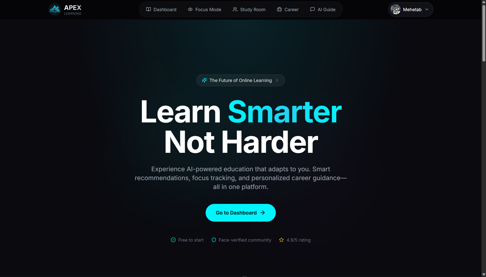
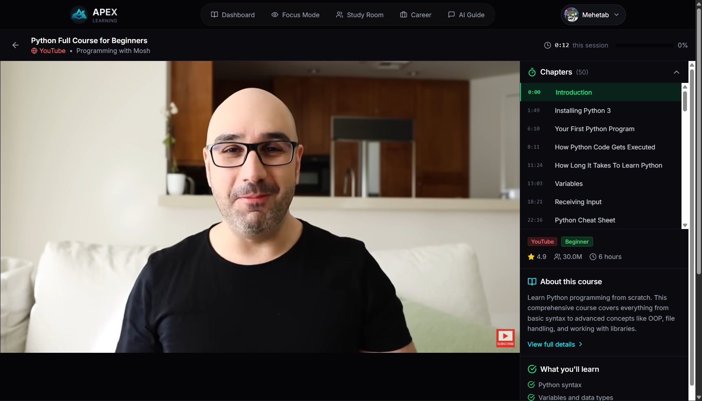
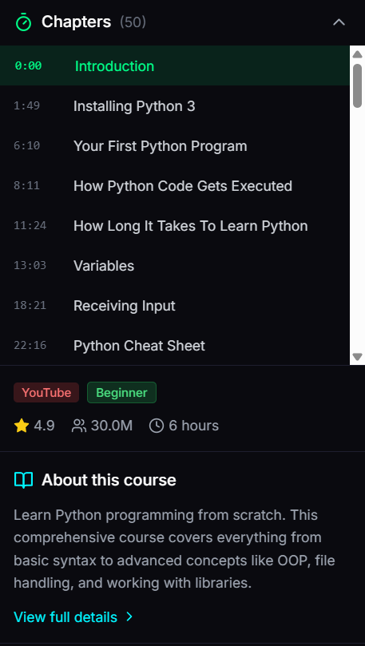
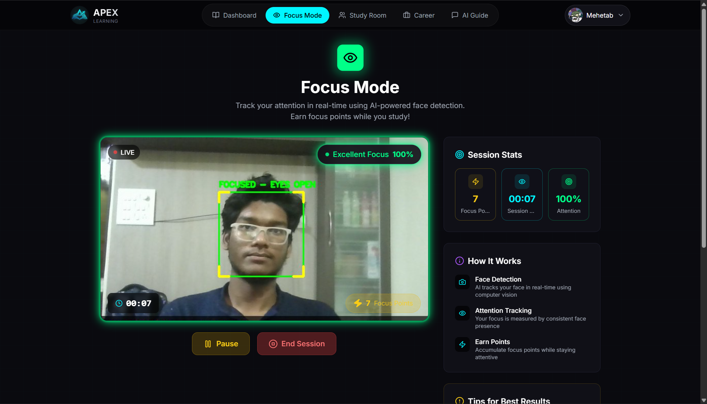
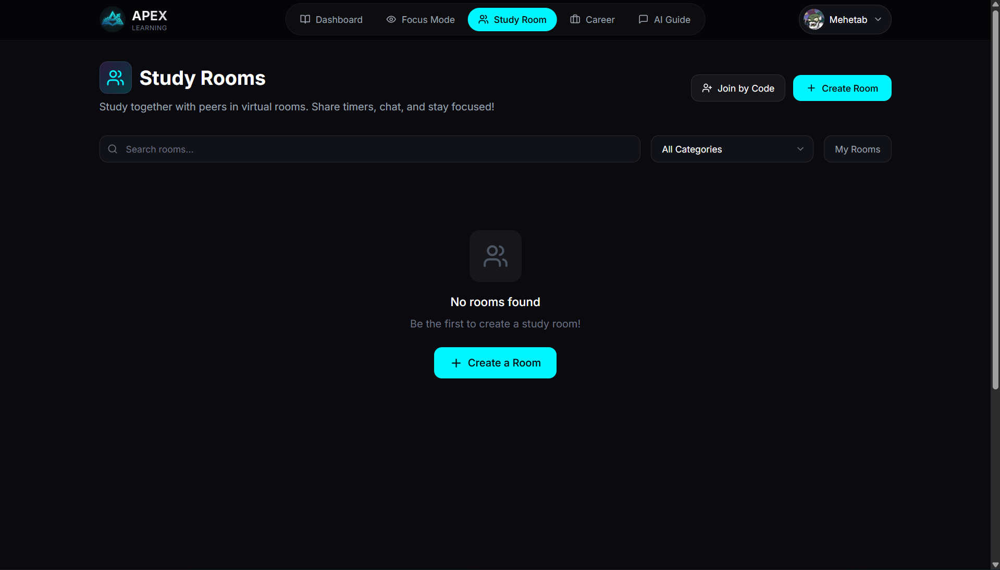
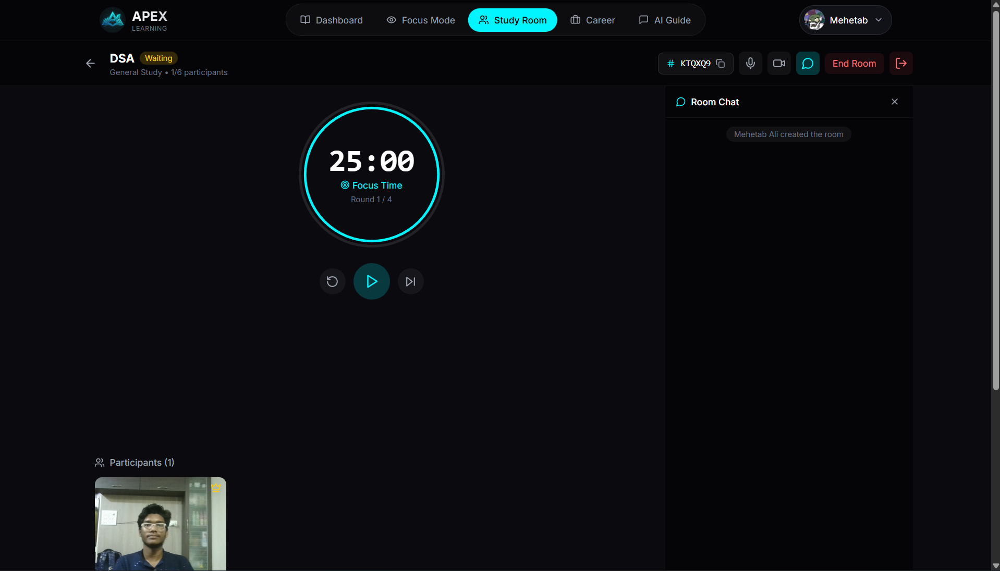
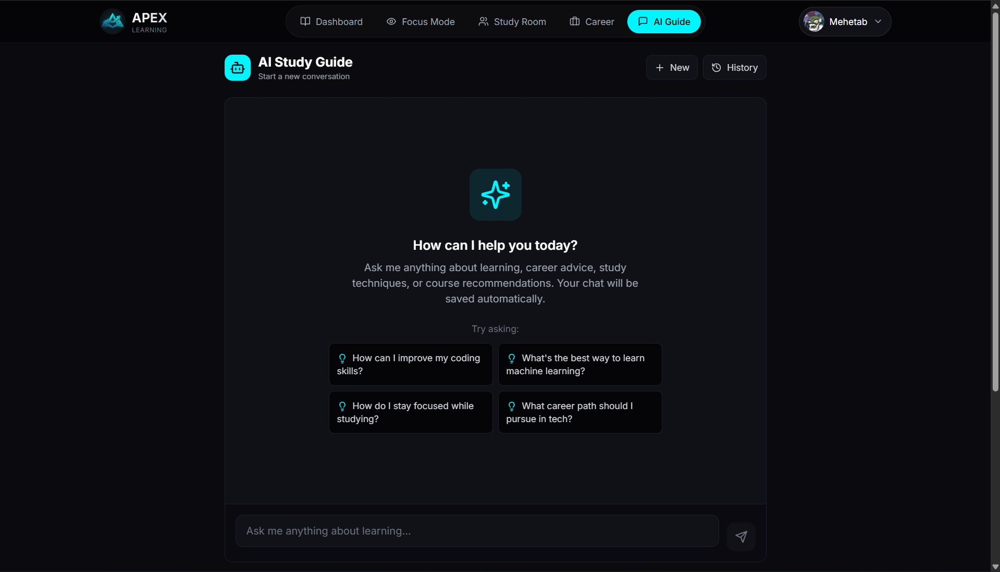
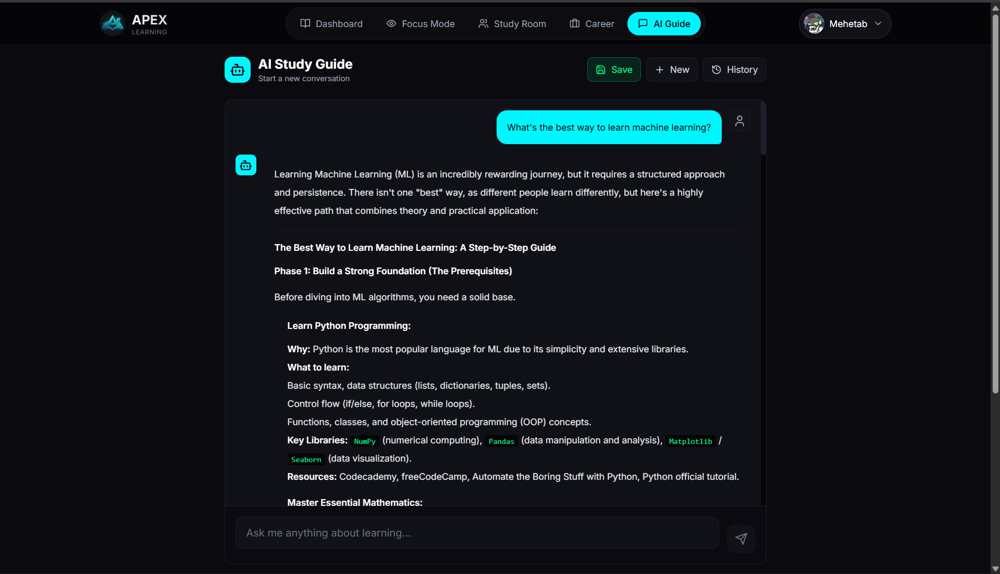
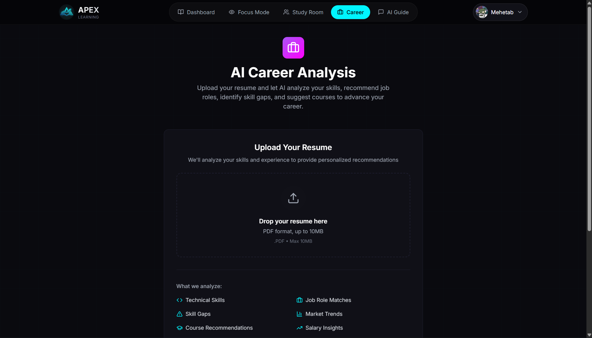
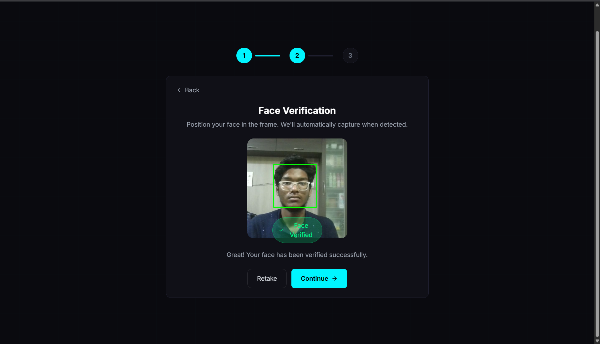

# APEX - AI-Powered E-Learning Content Recommendation System

<div align="center">


### Addressing UN SDG 4: Quality Education


**A comprehensive AI-powered e-learning platform that combines intelligent course recommendations, real-time attention tracking, collaborative study rooms, and 24/7 AI tutoring to transform online education.**

[Features](#-key-features) • [Installation](#-installation) • [Tech Stack](#-technology-stack) • [API Documentation](#-api-documentation)

</div>

---

## Table of Contents

- [Problem Statement](#-problem-statement)
- [Solution Overview](#-solution-overview)
- [Key Features](#-key-features)
- [Technology Stack](#-technology-stack)
- [System Architecture](#-system-architecture)
- [Installation](#-installation)
- [API Documentation](#-api-documentation)
- [Project Structure](#-project-structure)
- [SDG 4 Alignment](#-sdg-4-alignment)
- [Future Roadmap](#-future-roadmap)

---

## 🎯 Problem Statement

Online education has exploded, but **course completion rates remain dismally low at 3-15%**. The key challenges include:

| Problem | Impact |
|---------|--------|
| **Choice Overload** | 10,000+ courses available; students spend hours searching instead of learning |
| **No Personalization** | One-size-fits-all recommendations ignore skill gaps and career goals |
| **Zero Accountability** | No tracking of actual attention; students "watch" videos while distracted |
| **Expensive Guidance** | Personal tutors cost $50-200/hour; career counselors charge $100+ per session |
| **Scattered Resources** | Quality content spread across YouTube, Udemy, Coursera, NPTEL, etc. |
| **Isolation in Learning** | No peer collaboration or study groups for motivation |

---

## 💡 Solution Overview

**APEX** addresses the "overwhelming choice + zero accountability" problem through five core pillars:

```
┌─────────────────────────────────────────────────────────────────────────────┐
│                              APEX PLATFORM                                   │
├───────────────┬───────────────┬───────────────┬───────────────┬─────────────┤
│   DISCOVER    │     LEARN     │    FOCUS      │  COLLABORATE  │    GROW     │
│               │               │               │               │             │
│  AI Course    │  24/7 AI      │  Attention    │  Study        │  Career     │
│  Recommend-   │  Study        │  Tracking     │  Rooms with   │  Guidance   │
│  ations       │  Guide        │  (OpenCV)     │  Pomodoro     │  & Resume   │
│               │               │               │               │  Analysis   │
│  "What to     │  "Help when   │  "Stay        │  "Learn       │  "Where     │
│   learn"      │   stuck"      │   accountable"│   together"   │   to go"    │
└───────────────┴───────────────┴───────────────┴───────────────┴─────────────┘
```

---

## ✨ Key Features

### 1. AI-Powered Course Recommendations

Intelligent course discovery using **TF-IDF + Cosine Similarity** algorithm that analyzes:
- Course title, description, and content
- Category and difficulty level
- User preferences and learning history
- Career goals and skill gaps

**Two Recommendation Modes:**
- **Course-based:** "Similar to this course you liked"
- **Query-based:** "Based on your interests/skills"

<details>
<summary><b>📸 Screenshots</b></summary>

| Dashboard with Recommendations | Course Discovery |
|:------------------------------:|:----------------:|
|  |  |

</details>

---

### 2. YouTube Embedded Learning with Chapters

Watch courses directly within APEX without leaving the platform:
- **Embedded YouTube Player** with full controls
- **Auto-parsed Chapters** from video descriptions
- **Smooth Chapter Navigation** using YouTube IFrame API
- **Playlist Support** with video switching
- **Progress Tracking** for enrolled courses

<details>
<summary><b>📸 Screenshots</b></summary>

| Learning Page | Chapter Navigation |
|:-------------:|:------------------:|
|  |  |

</details>

---

### 3. Focus Mode - Real-Time Attention Tracking

Stay accountable with **webcam-based face detection** using OpenCV:
- **Real-time Face Detection** using Haar Cascades
- **Attention Score Calculation** (% of time face detected)
- **Focus Points & Gamification** for sustained attention
- **Session Statistics** saved to user profile
- **Visual Feedback** when distracted

**Metrics Tracked:**
| Metric | Description |
|--------|-------------|
| `attention_score` | Percentage of time face was detected |
| `focus_points` | Gamified points earned |
| `elapsed_time` | Total session duration |
| `face_detected_count` | Frames where face was present |

<details>
<summary><b>📸 Screenshots</b></summary>

| Focus Mode Active | Focus Statistics |
|:-----------------:|:----------------:|
|  |  |

</details>

---

### 4. Collaborative Study Rooms

Learn together with peers in real-time:
- **Create/Join Rooms** via room codes
- **Pomodoro Timer** with host controls (25/5 min cycles)
- **Live Video/Audio** with webcam and microphone support
- **Speaking Indicators** using Web Audio API
- **Room Chat** for text communication
- **Participant Management** with mute/camera toggles

<details>
<summary><b>📸 Screenshots</b></summary>

| Study Room Lobby | Active Study Room |
|:----------------:|:-----------------:|
|  |  |

</details>

---

### 5. AI Study Guide (24/7 Chat Tutor)

Get instant help anytime with **Google Gemini-powered** AI tutor:
- **Multi-turn Conversations** with context retention
- **Markdown Rendering** with code syntax highlighting
- **Suggested Follow-up Questions**
- **Conversation History** saved per user
- **Multiple AI Provider Support** (Gemini, Groq, Cohere fallbacks)

<details>
<summary><b>📸 Screenshots</b></summary>

| AI Chat Interface | Code Assistance |
|:-----------------:|:---------------:|
|  |  |

</details>

---

### 6. Career Guidance & Resume Analysis

Get personalized career roadmaps:
- **Resume Upload** (PDF parsing)
- **Skill Extraction** using AI
- **Gap Analysis** for target roles
- **Course Recommendations** to fill gaps
- **Career Path Suggestions**

<details>
<summary><b>📸 Screenshots</b></summary>

| Career & Resume Analysis |
|:------------------------:|
|  |

</details>

---

### 7. Multi-Platform Course Aggregation

One-stop discovery for courses across **14+ platforms**:

| Free Platforms | Certification | Practice |
|----------------|---------------|----------|
| YouTube | Coursera | HackerRank |
| freeCodeCamp | Udemy | LeetCode |
| MIT OpenCourseWare | Cisco NetAcad | CodeChef |
| NPTEL | edX | |
| Infosys Springboard | Cyfrin Updraft | |

---

### 8. Secure Authentication

Multiple authentication methods with security features:
- **Email/Phone Login** with OTP verification
- **Google OAuth 2.0** integration
- **JWT Authentication** with refresh tokens
- **Face Validation** for profile verification
- **SMS OTP** via Twilio
- **Email OTP** via Brevo/Sendinblue

<details>
<summary><b>📸 Screenshots</b></summary>

| Login Page | Registration | Face Validation |
|:----------:|:------------:|:---------------:|
|  |  |  |

</details>

---

## 🛠 Technology Stack

### Backend

| Technology | Version | Purpose |
|------------|---------|---------|
| Python | 3.10+ | Programming language |
| Django | 4.2 | Web framework |
| Django REST Framework | 3.14 | REST API |
| SimpleJWT | 5.3 | JWT authentication |
| OpenCV | 4.x | Face detection |
| Scikit-Learn | 1.3 | ML recommendations (TF-IDF) |
| Google Gemini | latest | AI chat responses |
| Twilio | latest | SMS OTP |
| Brevo/Sendinblue | latest | Email OTP |
| SQLite | 3 | Database (PostgreSQL ready) |

### Frontend

| Technology | Version | Purpose |
|------------|---------|---------|
| Next.js | 14 | React framework (App Router) |
| React | 18 | UI library |
| TypeScript | 5.0 | Type safety |
| Tailwind CSS | 3.4 | Styling |
| Framer Motion | 10 | Animations |
| Axios | 1.6 | HTTP client |
| Lucide React | latest | Icons |
| Web Audio API | native | Speaking detection |
| React Markdown | 9 | Chat rendering |

---

## 🏗 System Architecture

```
┌─────────────────────────────────────────────────────────────────────────────┐
│                           CLIENT (Browser)                                   │
│  ┌─────────────────────────────────────────────────────────────────────┐    │
│  │                      Next.js 14 Frontend                             │    │
│  │         React 18 + TypeScript + Tailwind CSS + Framer Motion         │    │
│  │                      http://localhost:3000                           │    │
│  └─────────────────────────────────────────────────────────────────────┘    │
└─────────────────────────────────────────────────────────────────────────────┘
                                      │
                                      │ REST API (JSON)
                                      │ JWT Authentication
                                      ▼
┌─────────────────────────────────────────────────────────────────────────────┐
│                           SERVER (Django)                                    │
│  ┌─────────────────────────────────────────────────────────────────────┐    │
│  │                   Django REST Framework Backend                      │    │
│  │                      http://localhost:8000                           │    │
│  │                                                                      │    │
│  │  ┌──────────────┐  ┌──────────────┐  ┌──────────────┐               │    │
│  │  │   accounts   │  │   learning   │  │  apex_backend│               │    │
│  │  │              │  │              │  │   (settings) │               │    │
│  │  │ - Auth       │  │ - Courses    │  │              │               │    │
│  │  │ - Users      │  │ - Recommend  │  │ - CORS       │               │    │
│  │  │ - OTP        │  │ - AI Chat    │  │ - JWT        │               │    │
│  │  │ - Face Valid │  │ - Focus Mode │  │ - Database   │               │    │
│  │  │              │  │ - Study Rooms│  │              │               │    │
│  │  └──────────────┘  └──────────────┘  └──────────────┘               │    │
│  └─────────────────────────────────────────────────────────────────────┘    │
└─────────────────────────────────────────────────────────────────────────────┘
                                      │
          ┌───────────────────────────┼───────────────────────────┐
          │                           │                           │
          ▼                           ▼                           ▼
┌──────────────────┐      ┌──────────────────┐      ┌──────────────────┐
│    SQLite DB     │      │   External APIs  │      │   AI Services    │
│                  │      │                  │      │                  │
│ - Users          │      │ - YouTube Data   │      │ - Google Gemini  │
│ - Courses        │      │ - Twilio SMS     │      │ - Groq (fallback)│
│ - Enrollments    │      │ - Brevo Email    │      │ - Cohere(fallback│
│ - Study Rooms    │      │                  │      │                  │
│ - Chat History   │      │                  │      │                  │
│ - Focus Sessions │      │                  │      │                  │
└──────────────────┘      └──────────────────┘      └──────────────────┘
```

---

## 📦 Installation

### Prerequisites

- Python 3.10+
- Node.js 18+
- Git
- Webcam (for Focus Mode & Study Rooms)

### Quick Start (Windows)

```bash
# Clone the repository
git clone https://github.com/mehetab-01/apex-ai.git
cd apex-ai

# Run both servers
start.bat
```

### Manual Setup

#### 1. Backend Setup

```bash
cd apex_backend

# Create virtual environment
python -m venv venv

# Activate virtual environment
# Windows:
venv\Scripts\activate
# Linux/Mac:
source venv/bin/activate

# Install dependencies
pip install -r requirements.txt

# Run database migrations
python manage.py migrate

# Create superuser (optional)
python manage.py createsuperuser

# Start Django server
python manage.py runserver
```

#### 2. Frontend Setup

```bash
cd apex_frontend

# Install dependencies
npm install

# Start development server
npm run dev
```

#### 3. Environment Variables

Create `apex_backend/.env`:

```env
# Django
DJANGO_SECRET_KEY=your-secret-key-here

# AI APIs
GEMINI_API_KEY=your-gemini-api-key
GROQ_API_KEY=your-groq-api-key (optional)
COHERE_API_KEY=your-cohere-api-key (optional)

# External APIs
YOUTUBE_API_KEY=your-youtube-api-key

# OTP Services (optional)
TWILIO_ACCOUNT_SID=your-twilio-sid
TWILIO_AUTH_TOKEN=your-twilio-token
TWILIO_PHONE_NUMBER=your-twilio-number
BREVO_API_KEY=your-brevo-api-key

# Debug
DEBUG=True
```

### Access the Application

- **Frontend:** http://localhost:3000
- **Backend API:** http://localhost:8000/api/
- **Admin Panel:** http://localhost:8000/admin/

---

## 📡 API Documentation

### Authentication Endpoints

| Method | Endpoint | Description |
|--------|----------|-------------|
| `POST` | `/api/auth/register/` | User registration |
| `POST` | `/api/auth/login/` | Email/phone login |
| `POST` | `/api/auth/send-otp/` | Send OTP (email/SMS) |
| `POST` | `/api/auth/verify-otp/` | Verify OTP code |
| `POST` | `/api/auth/google/` | Google OAuth login |
| `POST` | `/api/auth/validate-face/` | Face validation |
| `POST` | `/api/auth/token/refresh/` | Refresh JWT token |
| `GET` | `/api/auth/user/` | Get current user |

### Course & Learning Endpoints

| Method | Endpoint | Description |
|--------|----------|-------------|
| `GET` | `/api/courses/` | List all courses |
| `GET` | `/api/courses/{id}/` | Course details |
| `GET` | `/api/courses/categories/` | Course categories |
| `GET` | `/api/courses/platforms/` | Available platforms |
| `POST` | `/api/recommend/` | Course recommendations |
| `POST` | `/api/recommend/text/` | Query-based recommendations |
| `POST` | `/api/courses/{id}/enroll/` | Enroll in course |
| `GET` | `/api/courses/{id}/enrollment-status/` | Check enrollment |
| `GET` | `/api/enrollments/` | User's enrolled courses |
| `PUT` | `/api/enrollments/{id}/` | Update progress |
| `GET` | `/api/youtube/video-info/` | YouTube video details |

### Study Room Endpoints

| Method | Endpoint | Description |
|--------|----------|-------------|
| `GET` | `/api/rooms/` | List study rooms |
| `POST` | `/api/rooms/` | Create new room |
| `GET` | `/api/rooms/categories/` | Room categories |
| `POST` | `/api/rooms/join-by-code/` | Join via room code |
| `GET` | `/api/rooms/{id}/` | Room details |
| `POST` | `/api/rooms/{id}/join/` | Join room |
| `POST` | `/api/rooms/{id}/leave/` | Leave room |
| `GET` | `/api/rooms/{id}/messages/` | Room chat history |
| `POST` | `/api/rooms/{id}/messages/` | Send message |
| `POST` | `/api/rooms/{id}/timer/` | Control Pomodoro timer |
| `GET` | `/api/rooms/{id}/participants/` | List participants |
| `POST` | `/api/rooms/{id}/toggle-status/` | Toggle mic/camera |

### AI & Focus Endpoints

| Method | Endpoint | Description |
|--------|----------|-------------|
| `POST` | `/api/chat-guide/` | AI chat tutor |
| `GET` | `/api/chat-history/` | Chat conversations |
| `GET` | `/api/chat-history/{id}/` | Specific conversation |
| `POST` | `/api/upload-resume/` | Resume analysis |
| `GET` | `/api/focus/stats/` | Focus session stats |
| `POST` | `/api/focus/save-session/` | Save focus session |
| `GET` | `/video_feed/` | Live webcam stream |

---

## 📁 Project Structure

```
apex-ai/
│
├── apex_backend/                    # Django Backend
│   ├── accounts/                    # User Authentication
│   │   ├── models.py               # ApexUser model
│   │   ├── views.py                # Auth views (login, register, OTP)
│   │   └── serializers.py          # DRF serializers
│   │
│   ├── learning/                    # Core Learning Features
│   │   ├── api/
│   │   │   ├── views.py            # All API views
│   │   │   ├── serializers.py      # Course, Room serializers
│   │   │   └── urls.py             # URL routing
│   │   ├── models.py               # Course, Enrollment, StudyRoom models
│   │   ├── recommender.py          # TF-IDF recommendation engine
│   │   ├── ai_providers.py         # Gemini, Groq, Cohere integration
│   │   ├── focus_mode.py           # OpenCV face detection
│   │   └── cascades/               # Haar cascade files
│   │
│   ├── apex_backend/               # Django Settings
│   │   ├── settings.py             # Configuration
│   │   └── urls.py                 # Root URL routing
│   │
│   ├── requirements.txt            # Python dependencies
│   └── manage.py                   # Django CLI
│
├── apex_frontend/                   # Next.js Frontend
│   ├── app/                        # App Router Pages
│   │   ├── page.tsx                # Landing page
│   │   ├── login/                  # Authentication
│   │   ├── register/
│   │   ├── dashboard/              # Course discovery
│   │   ├── course/[id]/            # Course details
│   │   ├── learn/[id]/             # YouTube learning
│   │   ├── my-courses/             # Enrolled courses
│   │   ├── focus-mode/             # Attention tracking
│   │   ├── study-room/             # Collaborative rooms
│   │   ├── chat/                   # AI tutor
│   │   ├── career/                 # Resume analysis
│   │   ├── settings/               # User settings
│   │   ├── about/                  # Static pages
│   │   ├── blog/
│   │   ├── careers/
│   │   ├── contact/
│   │   ├── privacy-policy/
│   │   ├── terms-of-service/
│   │   └── cookie-policy/
│   │
│   ├── components/                 # Reusable Components
│   │   ├── Navbar.tsx
│   │   ├── Footer.tsx
│   │   ├── CourseCard.tsx
│   │   ├── StartCourseModal.tsx
│   │   ├── FocusStats.tsx
│   │   └── LoadingSpinner.tsx
│   │
│   ├── contexts/                   # React Contexts
│   │   ├── AuthContext.tsx
│   │   └── ChatContext.tsx
│   │
│   ├── lib/                        # Utilities
│   │   ├── api.ts                  # API client
│   │   └── utils.ts                # Helper functions
│   │
│   └── package.json                # Node dependencies
│
├── docs/                           # Documentation
│   └── screenshots/                # Screenshot images
│       ├── features/
│       └── pages/
│
├── start.bat                       # Windows quick start
├── stop.bat                        # Stop servers
└── README.md                       # This file
```

---

## 🎯 SDG 4 Alignment

This project directly supports **UN Sustainable Development Goal 4: Quality Education** through:

| SDG 4 Target | APEX Feature | Implementation |
|--------------|--------------|----------------|
| **4.1** Ensure quality primary/secondary education | Multi-platform course aggregation | Courses from 14+ free and paid platforms |
| **4.3** Equal access to technical/vocational education | AI-powered recommendations | Personalized learning paths for all skill levels |
| **4.4** Increase youth with relevant skills | Career guidance & resume analysis | AI-driven skill gap analysis and course suggestions |
| **4.5** Eliminate disparities in education | Free course aggregation | YouTube, freeCodeCamp, NPTEL, MIT OCW - all free |
| **4.6** Ensure literacy and numeracy | 24/7 AI tutor | Instant doubt clearance in any subject |
| **4.7** Education for sustainable development | Collaborative study rooms | Peer learning and knowledge sharing |

---

## 🚀 Feature Checklist

### Completed Features ✅

- [x] User authentication (email, phone, Google OAuth)
- [x] OTP verification (SMS via Twilio + Email via Brevo)
- [x] Face validation for profile verification
- [x] JWT authentication with refresh tokens
- [x] Course recommendation engine (TF-IDF + Cosine Similarity)
- [x] Multi-platform course aggregation (14+ platforms)
- [x] AI chat tutor (Gemini with Groq/Cohere fallbacks)
- [x] YouTube embedded learning with chapter navigation
- [x] Course enrollment and progress tracking
- [x] Focus mode with real-time face detection
- [x] Focus points gamification
- [x] Collaborative study rooms
- [x] Pomodoro timer with host controls
- [x] Live video/audio in study rooms
- [x] Speaking indicators (Web Audio API)
- [x] Room chat functionality
- [x] Career page with resume analysis
- [x] Complete static pages (About, Blog, Careers, Contact, Legal)
- [x] Responsive mobile-first design
- [x] Dark mode cyberpunk theme

### Future Roadmap 📋

- [ ] Proctored assessments using face validation
- [ ] Learning badges and achievement streaks
- [ ] Auto-generated quizzes from course content
- [ ] Voice-based AI tutor
- [ ] Certificate generation
- [ ] Organization/enterprise dashboards
- [ ] Mobile app (React Native)
- [ ] Offline course downloads

---

<div align="center">

**Built with ❤️ for Quality Education**

</div>
