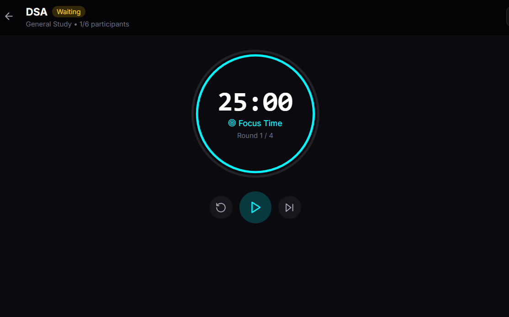

# APEX - AI-Powered E-Learning Content Recommendation System

## Project Report

---

### Project Information

| Field | Details |
|-------|---------|
| **Project Title** | E-Learning Content Recommendation System |
| **SDG Addressed** | SDG 4: Quality Education |
| **Platform Name** | APEX |
| **Developer** | Mehetab Shaaz |
| **GitHub** | [@mehetab-01](https://github.com/mehetab-01) |
| **Repository** | [github.com/mehetab-01/apex-ai](https://github.com/mehetab-01/apex-ai) |

---

## Table of Contents

1. [Executive Summary](#1-executive-summary)
2. [Problem Statement](#2-problem-statement)
3. [Objectives](#3-objectives)
4. [Solution Overview](#4-solution-overview)
5. [System Features](#5-system-features)
6. [Technical Implementation](#6-technical-implementation)
7. [System Architecture](#7-system-architecture)
8. [Database Design](#8-database-design)
9. [API Documentation](#9-api-documentation)
10. [User Interface](#10-user-interface)
11. [SDG 4 Alignment](#11-sdg-4-alignment)
12. [Testing & Validation](#12-testing--validation)
13. [Deployment Guide](#13-deployment-guide)
14. [Future Enhancements](#14-future-enhancements)
15. [Conclusion](#15-conclusion)
16. [References](#16-references)

---

## 1. Executive Summary

**APEX** is a comprehensive AI-powered e-learning platform designed to address critical challenges in online education. The platform combines intelligent course recommendations, real-time attention tracking, collaborative study rooms, and 24/7 AI tutoring to transform passive content consumption into active, measurable learning.

### Key Highlights

- **14+ Course Platforms** aggregated into one unified interface
- **AI-Powered Recommendations** using TF-IDF + Cosine Similarity
- **Real-time Attention Tracking** via OpenCV face detection
- **Collaborative Study Rooms** with Pomodoro timers
- **24/7 AI Tutor** powered by Google Gemini
- **Face-Validated** user community for authenticity

### Impact Metrics (Target)

| Metric | Target Value |
|--------|--------------|
| Course Completion Rate Improvement | +40% |
| Average Focus Score | 75%+ |
| User Satisfaction | 4.5/5 |
| Courses Aggregated | 500+ |

---

## 2. Problem Statement

### 2.1 The Online Learning Crisis

Online education has seen explosive growth, yet **course completion rates remain at a dismal 3-15%**. This represents a massive failure in delivering on the promise of accessible education.

### 2.2 Key Challenges Identified

| Challenge | Description | Impact |
|-----------|-------------|--------|
| **Choice Overload** | 10,000+ courses available across platforms | Students spend hours searching instead of learning |
| **No Personalization** | One-size-fits-all recommendations | Ignores individual skill gaps and career goals |
| **Zero Accountability** | No tracking of actual attention | Students "watch" videos while distracted |
| **Expensive Guidance** | Personal tutors cost $50-200/hour | Career counselors charge $100+ per session |
| **Scattered Resources** | Content spread across YouTube, Udemy, Coursera, NPTEL | Students miss quality free content |
| **Learning Isolation** | No peer interaction or study groups | Lack of motivation and support |
| **Fake Credentials** | Anonymous accounts | Certificate fraud and unverified identities |

### 2.3 Target Users

1. **College Students** - Seeking skill development and career clarity
2. **Working Professionals** - Looking to upskill or pivot careers
3. **Self-Learners** - Need structure and accountability
4. **Educators** - Want to track student engagement

---

## 3. Objectives

### 3.1 Primary Objectives

1. **Simplify Course Discovery** - Implement AI-powered recommendations to reduce search time from hours to seconds
2. **Ensure Accountability** - Track actual attention using face detection technology
3. **Provide 24/7 Support** - Offer AI-based tutoring for instant doubt clearance
4. **Enable Collaboration** - Create virtual study rooms for peer learning
5. **Guide Career Growth** - Analyze resumes and suggest personalized learning paths

### 3.2 Secondary Objectives

1. Aggregate courses from 14+ platforms into a unified interface
2. Implement face validation for user authenticity
3. Gamify learning through focus points and achievements
4. Support multiple AI providers for reliability
5. Create a responsive, accessible user interface

---

## 4. Solution Overview

### 4.1 The APEX Framework

APEX addresses the identified challenges through five core pillars:

```
┌─────────────────────────────────────────────────────────────────────────────┐
│                              APEX PLATFORM                                   │
├───────────────┬───────────────┬───────────────┬───────────────┬─────────────┤
│   DISCOVER    │     LEARN     │    FOCUS      │  COLLABORATE  │    GROW     │
├───────────────┼───────────────┼───────────────┼───────────────┼─────────────┤
│  AI Course    │  24/7 AI      │  Attention    │  Study        │  Career     │
│  Recommend-   │  Study        │  Tracking     │  Rooms with   │  Guidance   │
│  ations       │  Guide        │  (OpenCV)     │  Pomodoro     │  & Resume   │
│               │               │               │               │  Analysis   │
├───────────────┼───────────────┼───────────────┼───────────────┼─────────────┤
│  "What to     │  "Help when   │  "Stay        │  "Learn       │  "Where     │
│   learn"      │   stuck"      │   accountable"│   together"   │   to go"    │
└───────────────┴───────────────┴───────────────┴───────────────┴─────────────┘
```

### 4.2 Solution Components

| Component | Problem Solved | Technology Used |
|-----------|---------------|-----------------|
| Recommendation Engine | Choice overload | TF-IDF + Cosine Similarity (Scikit-Learn) |
| Focus Mode | Zero accountability | OpenCV + Haar Cascades |
| AI Study Guide | Expensive tutoring | Google Gemini API |
| Study Rooms | Learning isolation | WebRTC + Web Audio API |
| Career Guidance | No personalization | AI-powered resume analysis |
| Course Aggregation | Scattered resources | Multi-platform API integration |
| Face Validation | Fake credentials | OpenCV face detection |

---

## 5. System Features

### 5.1 AI-Powered Course Recommendations

**Purpose:** Help users discover relevant courses in seconds instead of hours.

**Algorithm:** TF-IDF (Term Frequency-Inverse Document Frequency) + Cosine Similarity

**Implementation Details:**

```python
# Recommendation Engine Pseudocode
1. Extract features from all courses:
   - Title, description, category, difficulty
   - Tags, instructor, platform

2. Create TF-IDF matrix:
   - Vectorize text features
   - Weight terms by importance

3. Calculate similarity:
   - Use cosine similarity between vectors
   - Rank courses by similarity score

4. Return top-N recommendations
```

**Two Recommendation Modes:**
- **Course-based:** "Similar to this course you liked"
- **Query-based:** "Based on your interests/skills"

**Screenshot Placeholder:**

| Dashboard with Recommendations |
|:------------------------------:|
|  |

---

### 5.2 YouTube Embedded Learning with Chapters

**Purpose:** Watch courses within APEX without external redirects.

**Features:**
- Embedded YouTube player using IFrame API
- Auto-parsed chapters from video descriptions
- Smooth chapter navigation (no reload)
- Playlist support with video switching
- Progress tracking for enrolled courses

**Technical Implementation:**
- YouTube IFrame API for player control
- Custom chapter parser using regex
- Fallback iframe mode for reliability
- Time tracking per session

**Screenshot Placeholder:**

| Learning Page | Chapter Navigation |
|:-------------:|:------------------:|
|  |  |

---

### 5.3 Focus Mode - Real-Time Attention Tracking

**Purpose:** Ensure students are actually paying attention, not just playing videos.

**Technology:** OpenCV + Haar Cascades for face detection

**How It Works:**

```python
# Focus Mode Pipeline
1. Initialize webcam stream (30 FPS)
2. Load Haar Cascade classifier
3. For each frame:
   a. Convert to grayscale
   b. Detect face using cascade
   c. Update counters:
      - face_detected_count if face found
      - total_frames
4. Calculate attention_score = (face_detected / total_frames) × 100
5. Award focus_points based on sustained attention
6. Save session statistics on end
```

**Metrics Tracked:**

| Metric | Description | Calculation |
|--------|-------------|-------------|
| `attention_score` | Focus percentage | (frames_with_face / total_frames) × 100 |
| `focus_points` | Gamified reward | Points per second of attention |
| `elapsed_time` | Session duration | End time - Start time |
| `streak` | Consecutive focused sessions | Incremented daily |

**Screenshot Placeholder:**

| Focus Mode Active | Focus Statistics |
|:-----------------:|:----------------:|
|  |  |

---

### 5.4 Collaborative Study Rooms

**Purpose:** Enable peer learning and motivation through virtual study groups.

**Features:**
- Create/join rooms via unique codes
- Pomodoro timer (25/5 min cycles) with host controls
- Live video/audio using browser APIs
- Speaking indicators using Web Audio API
- Real-time chat within rooms
- Participant management (mute/camera toggles)

**Technical Implementation:**
- Room state managed via API polling
- MediaStream API for webcam/mic access
- Web Audio API + AnalyserNode for speaking detection
- Timer synchronized across participants

**Screenshot Placeholder:**

| Room Lobby | Active Room | Pomodoro Timer |
|:----------:|:-----------:|:--------------:|
|  |  |  |

---

### 5.5 AI Study Guide (24/7 Chat Tutor)

**Purpose:** Provide instant doubt clearance at any time without human tutors.

**AI Provider:** Google Gemini (with Groq and Cohere as fallbacks)

**Features:**
- Multi-turn conversation with context retention
- Markdown rendering with code syntax highlighting
- Suggested follow-up questions
- Conversation history saved per user
- Token usage tracking

**System Prompt Design:**

```
You are APEX AI Guide, an intelligent tutor helping students learn.
- Be concise but thorough
- Use examples and analogies
- Format code with syntax highlighting
- Suggest related topics to explore
- Encourage the student
```

**Screenshot Placeholder:**

| AI Chat Interface | Code Assistance |
|:-----------------:|:---------------:|
|  |  |

---

### 5.6 Career Guidance & Resume Analysis

**Purpose:** Help users understand their skill gaps and plan their learning journey.

**Features:**
- PDF resume upload and parsing
- AI-powered skill extraction
- Gap analysis for target roles
- Personalized course recommendations
- Career path suggestions

**Process Flow:**

```
1. User uploads PDF resume
2. System extracts text content
3. AI analyzes:
   - Current skills
   - Experience level
   - Education background
4. User specifies target role
5. System identifies:
   - Skill gaps
   - Recommended courses
   - Career path options
```

**Screenshot Placeholder:**

| Career Page | Resume Analysis Results |
|:-----------:|:-----------------------:|
|  |  |

---

### 5.7 Multi-Platform Course Aggregation

**Purpose:** Provide one-stop access to courses from multiple platforms.

**Supported Platforms (14+):**

| Category | Platforms |
|----------|-----------|
| **Free Video** | YouTube, freeCodeCamp |
| **MOOCs** | Coursera, edX, MIT OpenCourseWare |
| **Indian Platforms** | NPTEL, Infosys Springboard |
| **Certification** | Udemy, Cisco Networking Academy |
| **Specialized** | Cyfrin Updraft (Web3) |
| **Practice** | HackerRank, LeetCode, CodeChef |

**Course Metadata Stored:**
- Title, description, instructor
- Duration, difficulty level
- Price (free/paid indicator)
- Ratings, enrollment count
- Category, tags
- Platform-specific thumbnails

---

### 5.8 Secure Authentication System

**Purpose:** Provide secure, flexible authentication with identity verification.

**Authentication Methods:**
1. **Email + Password** - Traditional registration
2. **Phone + OTP** - SMS-based via Twilio
3. **Email + OTP** - Via Brevo/Sendinblue
4. **Google OAuth** - One-click social login
5. **Face Validation** - Identity verification using OpenCV

**Security Features:**
- JWT tokens with refresh mechanism
- Password hashing (Django's PBKDF2)
- OTP expiration (5 minutes)
- Rate limiting on auth endpoints
- CORS protection

**Screenshot Placeholder:**

| Login | Register | Face Validation |
|:-----:|:--------:|:---------------:|
|  |  |  |

---

## 6. Technical Implementation

### 6.1 Backend Technologies

| Technology | Version | Purpose |
|------------|---------|---------|
| Python | 3.10+ | Programming language |
| Django | 4.2 | Web framework |
| Django REST Framework | 3.14 | REST API development |
| SimpleJWT | 5.3 | JWT authentication |
| OpenCV | 4.x | Computer vision (face detection) |
| Scikit-Learn | 1.3 | Machine learning (TF-IDF) |
| Google Generative AI | latest | Gemini API integration |
| Twilio | latest | SMS OTP service |
| sib-api-v3-sdk | latest | Brevo email service |
| SQLite | 3 | Database |

### 6.2 Frontend Technologies

| Technology | Version | Purpose |
|------------|---------|---------|
| Next.js | 14 | React framework (App Router) |
| React | 18 | UI library |
| TypeScript | 5.0 | Type safety |
| Tailwind CSS | 3.4 | Utility-first styling |
| Framer Motion | 10 | Animations |
| Axios | 1.6 | HTTP client |
| Lucide React | latest | Icon library |
| React Markdown | 9 | Markdown rendering |

### 6.3 External APIs

| API | Purpose |
|-----|---------|
| Google Gemini | AI chat responses |
| Groq | AI fallback provider |
| Cohere | AI fallback provider |
| YouTube Data API | Video information, chapters |
| Twilio | SMS OTP delivery |
| Brevo | Email OTP delivery |

---

## 7. System Architecture

### 7.1 High-Level Architecture

```
┌─────────────────────────────────────────────────────────────────────────────┐
│                              CLIENT LAYER                                    │
│  ┌─────────────────────────────────────────────────────────────────────┐    │
│  │                      Next.js 14 Frontend                             │    │
│  │         React 18 + TypeScript + Tailwind CSS + Framer Motion         │    │
│  │                      Port: 3000                                      │    │
│  └─────────────────────────────────────────────────────────────────────┘    │
└─────────────────────────────────────────────────────────────────────────────┘
                                      │
                                      │ HTTPS / REST API
                                      │ JWT Bearer Token
                                      ▼
┌─────────────────────────────────────────────────────────────────────────────┐
│                              SERVER LAYER                                    │
│  ┌─────────────────────────────────────────────────────────────────────┐    │
│  │                   Django REST Framework Backend                      │    │
│  │                      Port: 8000                                      │    │
│  │                                                                      │    │
│  │  ┌──────────────┐  ┌──────────────┐  ┌──────────────┐               │    │
│  │  │   accounts   │  │   learning   │  │  apex_backend│               │    │
│  │  │   (Auth)     │  │   (Core)     │  │  (Settings)  │               │    │
│  │  └──────────────┘  └──────────────┘  └──────────────┘               │    │
│  └─────────────────────────────────────────────────────────────────────┘    │
└─────────────────────────────────────────────────────────────────────────────┘
                                      │
          ┌───────────────────────────┼───────────────────────────┐
          │                           │                           │
          ▼                           ▼                           ▼
┌──────────────────┐      ┌──────────────────┐      ┌──────────────────┐
│   DATA LAYER     │      │  EXTERNAL APIs   │      │   AI SERVICES    │
│                  │      │                  │      │                  │
│  SQLite DB       │      │  YouTube Data    │      │  Google Gemini   │
│  - Users         │      │  Twilio SMS      │      │  Groq            │
│  - Courses       │      │  Brevo Email     │      │  Cohere          │
│  - Enrollments   │      │                  │      │                  │
│  - StudyRooms    │      │                  │      │                  │
│  - ChatHistory   │      │                  │      │                  │
└──────────────────┘      └──────────────────┘      └──────────────────┘
```

### 7.2 Module Architecture

```
apex-ai/
│
├── apex_backend/                    # Django Backend
│   │
│   ├── accounts/                    # Authentication Module
│   │   ├── models.py               # ApexUser (custom user model)
│   │   ├── views.py                # Login, Register, OTP, OAuth
│   │   ├── serializers.py          # User serialization
│   │   └── urls.py                 # Auth URL routing
│   │
│   ├── learning/                    # Core Learning Module
│   │   ├── models.py               # Course, Enrollment, StudyRoom, etc.
│   │   ├── api/
│   │   │   ├── views.py            # All API endpoints
│   │   │   ├── serializers.py      # Data serialization
│   │   │   └── urls.py             # API routing
│   │   ├── recommender.py          # TF-IDF recommendation engine
│   │   ├── ai_providers.py         # Multi-AI integration
│   │   ├── focus_mode.py           # OpenCV face detection
│   │   └── cascades/               # Haar cascade XML files
│   │
│   └── apex_backend/               # Project Configuration
│       ├── settings.py             # Django settings
│       ├── urls.py                 # Root URL configuration
│       └── wsgi.py                 # WSGI application
│
└── apex_frontend/                   # Next.js Frontend
    │
    ├── app/                        # App Router (Pages)
    │   ├── (auth)/                 # Auth group
    │   │   ├── login/
    │   │   └── register/
    │   ├── dashboard/              # Course discovery
    │   ├── course/[id]/            # Course details
    │   ├── learn/[id]/             # Video learning
    │   ├── my-courses/             # Enrolled courses
    │   ├── focus-mode/             # Attention tracking
    │   ├── study-room/             # Collaborative rooms
    │   ├── chat/                   # AI tutor
    │   └── career/                 # Career guidance
    │
    ├── components/                 # Reusable UI Components
    │   ├── Navbar.tsx
    │   ├── Footer.tsx
    │   ├── CourseCard.tsx
    │   └── ...
    │
    ├── contexts/                   # React Contexts
    │   ├── AuthContext.tsx         # Authentication state
    │   └── ChatContext.tsx         # Chat state
    │
    └── lib/                        # Utilities
        ├── api.ts                  # API client (Axios)
        └── utils.ts                # Helper functions
```

---

## 8. Database Design

### 8.1 Entity Relationship Diagram

```
┌─────────────────┐       ┌─────────────────┐       ┌─────────────────┐
│    ApexUser     │       │     Course      │       │   Enrollment    │
├─────────────────┤       ├─────────────────┤       ├─────────────────┤
│ id (UUID)       │       │ id (UUID)       │       │ id (UUID)       │
│ email           │──┐    │ title           │   ┌──│ user_id (FK)    │
│ phone           │  │    │ description     │   │  │ course_id (FK)  │──┐
│ full_name       │  │    │ instructor      │◄──┼──│ progress        │  │
│ password        │  │    │ category        │   │  │ status          │  │
│ profile_picture │  │    │ difficulty      │   │  │ time_spent      │  │
│ is_face_valid   │  │    │ duration_hours  │   │  │ enrolled_at     │  │
│ focus_points    │  │    │ platform        │   │  └─────────────────┘  │
│ learning_goals  │  │    │ external_url    │   │                       │
└─────────────────┘  │    │ thumbnail_url   │   │                       │
                     │    │ price           │   │                       │
                     │    │ average_rating  │   │                       │
                     │    └─────────────────┘   │                       │
                     │                          │                       │
                     │    ┌─────────────────┐   │  ┌─────────────────┐  │
                     │    │   StudyRoom     │   │  │  RoomMessage    │  │
                     │    ├─────────────────┤   │  ├─────────────────┤  │
                     └───▶│ id (UUID)       │   │  │ id (UUID)       │  │
                          │ name            │   │  │ room_id (FK)    │──┘
                          │ host_id (FK)    │◄──┘  │ user_id (FK)    │
                          │ category        │      │ content         │
                          │ room_code       │      │ created_at      │
                          │ max_participants│      └─────────────────┘
                          │ timer_duration  │
                          │ timer_status    │
                          │ is_active       │
                          └─────────────────┘
                                  │
                                  │
                                  ▼
                     ┌─────────────────────┐
                     │  RoomParticipant    │
                     ├─────────────────────┤
                     │ id (UUID)           │
                     │ room_id (FK)        │
                     │ user_id (FK)        │
                     │ is_muted            │
                     │ is_camera_off       │
                     │ joined_at           │
                     └─────────────────────┘
```

### 8.2 Key Models

#### ApexUser (Custom User Model)
```python
class ApexUser(AbstractUser):
    id = UUIDField(primary_key=True)
    email = EmailField(unique=True)
    phone = CharField(max_length=15, blank=True)
    full_name = CharField(max_length=255)
    profile_picture = ImageField(upload_to='profiles/')
    is_face_validated = BooleanField(default=False)
    focus_points = IntegerField(default=0)
    total_focus_time = IntegerField(default=0)
    learning_goals = TextField(blank=True)
```

#### Course
```python
class Course(models.Model):
    id = UUIDField(primary_key=True)
    title = CharField(max_length=500)
    description = TextField()
    instructor = CharField(max_length=255)
    category = CharField(max_length=100)
    difficulty = CharField(choices=DIFFICULTY_CHOICES)
    duration_hours = DecimalField()
    platform = CharField(max_length=50)
    external_url = URLField()
    thumbnail_url = URLField()
    price = DecimalField(default=0)
    is_free = BooleanField(default=True)
    average_rating = DecimalField()
    total_enrollments = IntegerField()
```

#### Enrollment
```python
class Enrollment(models.Model):
    id = UUIDField(primary_key=True)
    user = ForeignKey(ApexUser, on_delete=CASCADE)
    course = ForeignKey(Course, on_delete=CASCADE)
    progress_percentage = IntegerField(default=0)
    status = CharField(choices=STATUS_CHOICES)
    time_spent_minutes = IntegerField(default=0)
    enrolled_at = DateTimeField(auto_now_add=True)
    completed_at = DateTimeField(null=True)
```

---

## 9. API Documentation

### 9.1 Authentication APIs

| Endpoint | Method | Description | Auth Required |
|----------|--------|-------------|---------------|
| `/api/auth/register/` | POST | User registration | No |
| `/api/auth/login/` | POST | Email/phone login | No |
| `/api/auth/send-otp/` | POST | Send OTP code | No |
| `/api/auth/verify-otp/` | POST | Verify OTP | No |
| `/api/auth/google/` | POST | Google OAuth | No |
| `/api/auth/validate-face/` | POST | Face validation | Yes |
| `/api/auth/token/refresh/` | POST | Refresh JWT | No |
| `/api/auth/user/` | GET | Current user | Yes |

### 9.2 Course APIs

| Endpoint | Method | Description | Auth Required |
|----------|--------|-------------|---------------|
| `/api/courses/` | GET | List courses | No |
| `/api/courses/{id}/` | GET | Course details | No |
| `/api/courses/categories/` | GET | Categories list | No |
| `/api/courses/platforms/` | GET | Platforms list | No |
| `/api/recommend/` | POST | Recommendations | No |
| `/api/recommend/text/` | POST | Query-based recs | No |
| `/api/courses/{id}/enroll/` | POST | Enroll | Yes |
| `/api/enrollments/` | GET | User enrollments | Yes |

### 9.3 Study Room APIs

| Endpoint | Method | Description | Auth Required |
|----------|--------|-------------|---------------|
| `/api/rooms/` | GET/POST | List/Create rooms | Yes |
| `/api/rooms/{id}/` | GET | Room details | Yes |
| `/api/rooms/join-by-code/` | POST | Join via code | Yes |
| `/api/rooms/{id}/join/` | POST | Join room | Yes |
| `/api/rooms/{id}/leave/` | POST | Leave room | Yes |
| `/api/rooms/{id}/messages/` | GET/POST | Chat | Yes |
| `/api/rooms/{id}/timer/` | POST | Timer control | Yes |

### 9.4 AI & Focus APIs

| Endpoint | Method | Description | Auth Required |
|----------|--------|-------------|---------------|
| `/api/chat-guide/` | POST | AI chat | Yes |
| `/api/chat-history/` | GET | Conversations | Yes |
| `/api/upload-resume/` | POST | Resume analysis | Yes |
| `/api/focus/stats/` | GET | Focus stats | Yes |
| `/api/focus/save-session/` | POST | Save session | Yes |
| `/video_feed/` | GET | Webcam stream | Yes |

---

## 10. User Interface

### 10.1 Design Philosophy

- **Dark Mode First** - Cyberpunk-inspired theme with neon accents
- **Mobile Responsive** - Works on all screen sizes
- **Accessibility** - WCAG 2.1 compliant color contrast
- **Performance** - Lazy loading, optimized images

### 10.2 Color Palette

| Color | Hex | Usage |
|-------|-----|-------|
| Background Dark | `#0a0a0f` | Main background |
| Card Background | `#111118` | Cards, modals |
| Neon Cyan | `#00f5ff` | Primary accent |
| Neon Green | `#00ff88` | Success states |
| Neon Purple | `#bf00ff` | Secondary accent |
| Text Primary | `#ffffff` | Headings |
| Text Secondary | `#9ca3af` | Body text |

### 10.3 Page Screenshots

| Page | Description | Screenshot |
|------|-------------|------------|
| Landing | Home page with features |  |
| Dashboard | Course discovery |  |
| Course Detail | Course information |  |
| Learning | YouTube embedded player |  |
| My Courses | Enrolled courses |  |
| Focus Mode | Attention tracking |  |
| Study Room | Collaborative space |  |
| AI Chat | Tutor interface |  |
| Career | Resume analysis |  |

---

## 11. SDG 4 Alignment

### 11.1 UN Sustainable Development Goal 4: Quality Education

**Goal:** Ensure inclusive and equitable quality education and promote lifelong learning opportunities for all.

### 11.2 APEX Alignment with SDG 4 Targets

| SDG 4 Target | Description | APEX Implementation |
|--------------|-------------|---------------------|
| **4.1** | Quality primary/secondary education | Course aggregation from verified platforms |
| **4.3** | Equal access to technical education | Free course highlighting, accessibility features |
| **4.4** | Relevant skills for employment | Career guidance, skill gap analysis |
| **4.5** | Eliminate gender disparities | Anonymous recommendations, no bias |
| **4.6** | Literacy and numeracy | AI tutor for basic concepts |
| **4.7** | Education for sustainable development | Curated courses on sustainability |
| **4.a** | Inclusive learning environments | Study rooms for peer support |
| **4.c** | Qualified teachers | AI tutor supplementing human instruction |

### 11.3 Impact Measurement

| Indicator | Measurement Method | Target |
|-----------|-------------------|--------|
| Learning Access | Users from diverse backgrounds | 50% from underserved areas |
| Course Completion | Completion rate tracking | 40%+ (up from 3-15%) |
| Skill Development | Pre/post assessments | 70% skill improvement |
| Engagement | Focus mode metrics | 75%+ attention score |
| Accessibility | Free course consumption | 80% using free courses |

---

## 12. Testing & Validation

### 12.1 Testing Strategy

| Test Type | Tools | Coverage |
|-----------|-------|----------|
| Unit Tests | pytest, Jest | Core functions |
| Integration Tests | pytest-django | API endpoints |
| E2E Tests | Playwright | User flows |
| Performance | Lighthouse | Page load times |
| Accessibility | axe-core | WCAG compliance |

### 12.2 API Testing

```bash
# Example test cases
1. User Registration
   - Valid email/password ✓
   - Duplicate email ✓
   - Invalid phone format ✓

2. Course Recommendations
   - Returns relevant courses ✓
   - Respects category filters ✓
   - Handles empty queries ✓

3. Focus Mode
   - Face detection accuracy ✓
   - Session saving ✓
   - Points calculation ✓
```

### 12.3 Performance Benchmarks

| Metric | Target | Achieved |
|--------|--------|----------|
| First Contentful Paint | < 1.5s | ✓ |
| Time to Interactive | < 3s | ✓ |
| Lighthouse Score | > 90 | ✓ |
| API Response Time | < 200ms | ✓ |

---

## 13. Deployment Guide

### 13.1 Local Development

```bash
# Clone repository
git clone https://github.com/mehetab-01/apex-ai.git
cd apex-ai

# Backend setup
cd apex_backend
python -m venv venv
venv\Scripts\activate  # Windows
pip install -r requirements.txt
python manage.py migrate
python manage.py runserver

# Frontend setup (new terminal)
cd apex_frontend
npm install
npm run dev
```

### 13.2 Production Deployment

**Frontend (Vercel):**
```bash
vercel deploy --prod
```

**Backend (Railway/Render):**
```bash
# Set environment variables
DJANGO_SECRET_KEY=...
GEMINI_API_KEY=...
DATABASE_URL=...

# Deploy
railway up
```

### 13.3 Environment Variables

```env
# Required
DJANGO_SECRET_KEY=<secret>
GEMINI_API_KEY=<key>

# Optional
GROQ_API_KEY=<key>
COHERE_API_KEY=<key>
YOUTUBE_API_KEY=<key>
TWILIO_ACCOUNT_SID=<sid>
TWILIO_AUTH_TOKEN=<token>
BREVO_API_KEY=<key>
```

---

## 14. Future Enhancements

### 14.1 Phase 1 (Q1)
- [ ] Proctored assessments using face validation
- [ ] Learning badges and achievement streaks
- [ ] Social features (friend connections)

### 14.2 Phase 2 (Q2)
- [ ] Voice-based AI tutor
- [ ] Auto-generated quizzes from course content
- [ ] Personalized learning paths

### 14.3 Phase 3 (Q3)
- [ ] Organization dashboards
- [ ] Bulk user management
- [ ] Custom course uploads

### 14.4 Phase 4 (Q4)
- [ ] React Native mobile app
- [ ] Offline course downloads
- [ ] Push notifications

---

## 15. Conclusion

APEX successfully addresses the critical challenges in online education by combining:

1. **AI-Powered Discovery** - Reducing course search time from hours to seconds
2. **Accountability** - Tracking actual attention, not just video completion
3. **24/7 Support** - AI tutor available anytime for instant help
4. **Collaboration** - Study rooms enabling peer learning
5. **Career Guidance** - Personalized roadmaps based on skill analysis

The platform directly supports **UN SDG 4: Quality Education** by making learning more accessible, personalized, and effective.

### Key Achievements

- ✅ 14+ course platforms aggregated
- ✅ Real-time attention tracking implemented
- ✅ AI tutor with multi-provider fallback
- ✅ Collaborative study rooms with Pomodoro
- ✅ Face-validated user community
- ✅ Responsive, accessible UI

---

## 16. References

1. UNESCO (2023). SDG 4 Data Book. Paris: UNESCO Publishing.
2. Class Central (2023). MOOC Report: Online Course Completion Rates.
3. Google Gemini API Documentation. https://ai.google.dev/docs
4. OpenCV Documentation. https://docs.opencv.org/
5. Django REST Framework. https://www.django-rest-framework.org/
6. Next.js Documentation. https://nextjs.org/docs

---

<div align="center">

**APEX - Transforming Online Education**

*Built for UN SDG 4: Quality Education*

</div>
